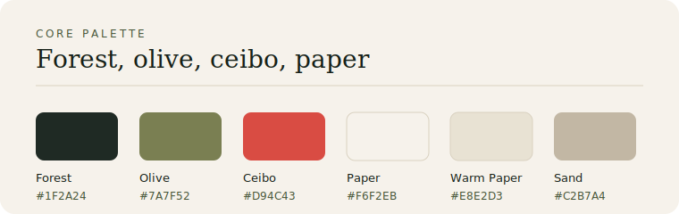
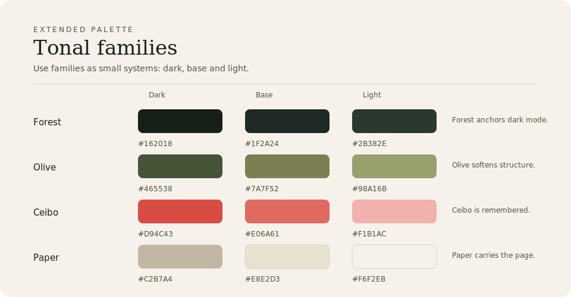

# Color

Color should establish atmosphere before it asks for attention.

## Core palette

| Token | Hex | Role |
|---|---:|---|
| Forest | `#1F2A24` | primary dark |
| Olive | `#7A7F52` | secondary organic tone |
| Ceibo | `#D94C43` | accent |
| Paper | `#F6F2EB` | main background |
| Warm Paper | `#E8E2D3` | cards, panels, subtle fills |

## Extended palette

| Family | Dark | Base | Light |
|---|---:|---:|---:|
| Forest | `#162018` | `#1F2A24` | `#2B382E` |
| Olive | `#465538` | `#7A7F52` | `#98A16B` |
| Ceibo | `#D94C43` | `#E06A61` | `#F1B1AC` |
| Paper | `#C2B7A4` | `#E8E2D3` | `#F6F2EB` |

## Usage ratio

- 80% paper and neutrals
- 15% greens and olives
- 5% ceibo red

Ceibo red is an accent. Use it for emphasis, icons, underlines and small highlights.

## Token exports

Current token files:

- `assets/palette/ontahi-palette.json`
- `assets/palette/ontahi-palette.css`
- `assets/palette/ontahi-palette.ts`
- `assets/palette/tailwind-preset.ts`

Tokens should be portable before they are clever.

Red should be remembered, not noticed.
