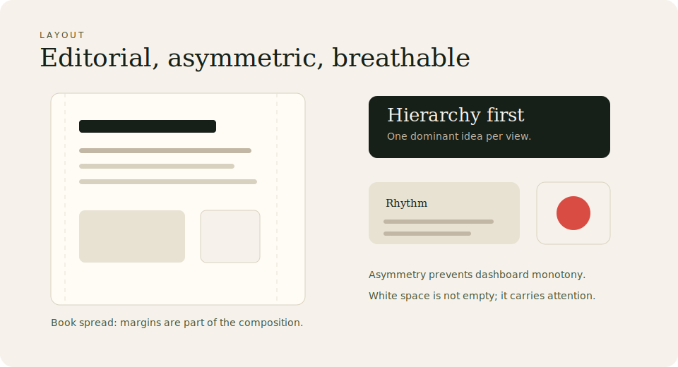

# Layout

\concept{Ontahí} layouts should feel \term{editorial}.

Prefer:

- \term{large margins}
- \term{asymmetric balance}
- \term{visible hierarchy}
- \term{breathing room}
- sections that feel like book spreads
- cards that feel like paper

Avoid:

- dense dashboards
- equal-weight grids everywhere
- heavy dark sections unless showing code
- excessive shadows

Silence is also part of the interface.
