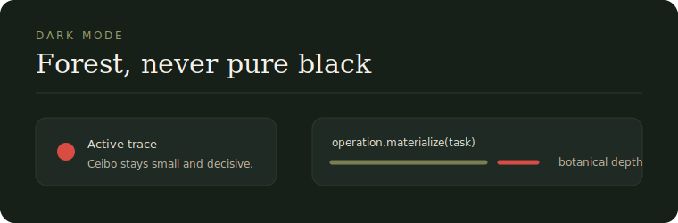

# Dark Mode

\concept{Dark mode} is essential for \concept{Ontahí} because code, runtime traces and technical work often live in dark surfaces.

The dark surface is \term{forest}, not black.

Use:

- Forest Dark for deep backgrounds
- Forest for panels
- Olive for quiet structure
- Ceibo for small active marks
- Paper for text only when contrast needs it

Avoid pure black, neon accents and high-gloss panels.

Dark mode should feel \term{botanical}, quiet and serious.
