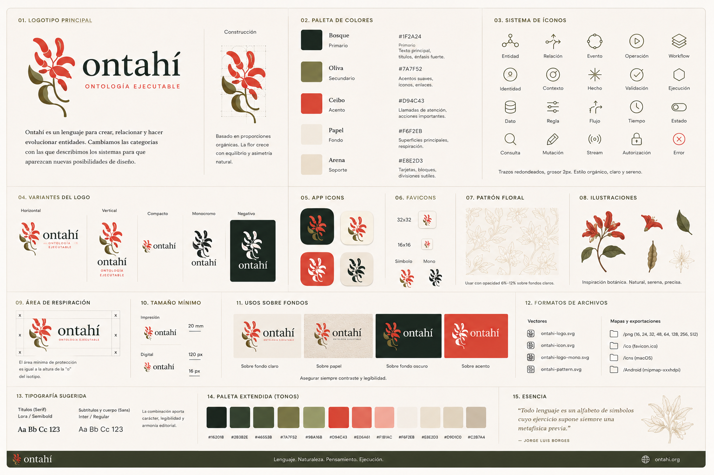

# The Ceibo

This specimen is a directional reference. It shows the language as a kit: color, icons, logo variants, botanical fragments, dark surfaces, and exportable assets.

The ceibo (*Erythrina crista-galli*) is the national flower of Argentina.

It brings several meanings into Ontahí:

- living domains
- organic relationships
- regional identity
- resilience
- beauty
- non-corporate warmth

Use the ceibo subtly.

It should not become folklore.

It should work as an elegant botanical symbol.

A symbol should not explain itself. It should invite recognition.
