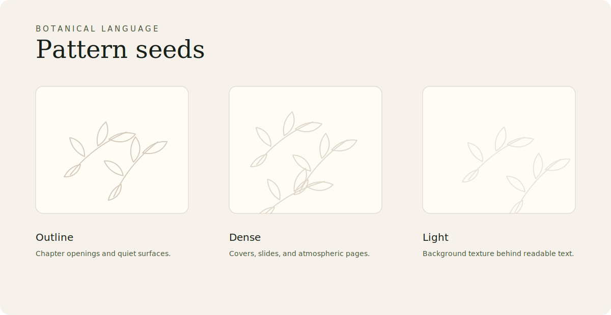

# Patterns and Texture

The subtle \concept{ceibo outline pattern} can be used as a \term{background texture}.

## Rules

- use very low contrast
- prefer warm beige or muted olive
- never compete with text
- avoid repeating too mechanically
- use it to create \term{atmosphere}, not decoration

Good uses:

- hero background
- chapter opening
- subtle page texture
- empty states
- presentation covers

Useful variants:

- outline
- dense
- minimal
- single branch
- flower only
- leaf only

## Current assets

- `assets/patterns/ceibo-outline.svg`
- `assets/patterns/ceibo-dense.svg`
- `assets/patterns/ceibo-light.svg`
