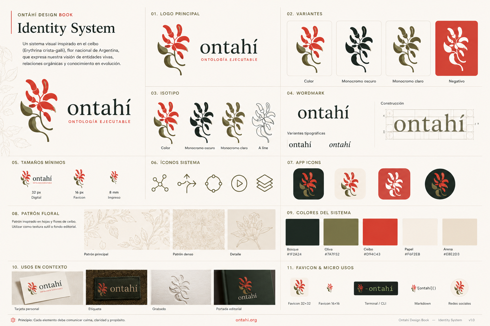

# Logo

This specimen is a directional reference for identity: logo, isotipo, wordmark, line variant, app icons, micro-uses, floral patterns, and restrained applications.

The primary logo combines:

- a stylized ceibo flower
- the wordmark `ontahí`
- the descriptor `Ontología Ejecutable` or `Executable Ontology`

The ceibo mark may be used independently as:

- favicon
- app icon
- CLI icon
- small badge
- section marker
- loader mark
- social avatar

The mark should remain organic, asymmetric and botanical.

Avoid turning it into a generic tech symbol.

The line variant is especially useful for small, monochrome, or code-adjacent contexts.
