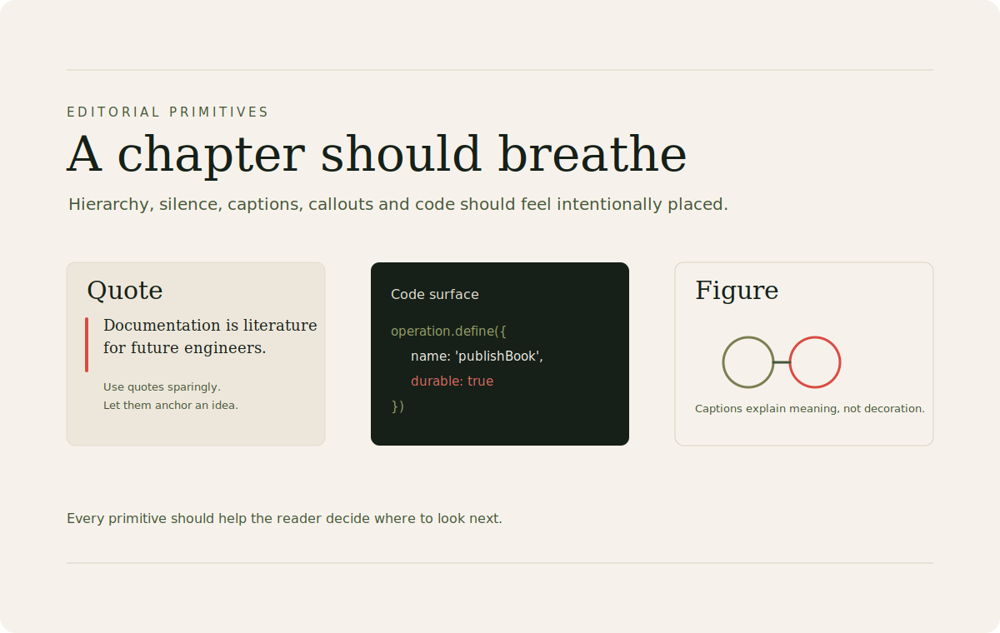

# Editorial Primitives

\concept{BookOps} and \concept{Ontahí documentation} should define visual treatment for:

- titles
- subtitles
- chapter openings
- quotes
- callouts
- footnotes
- figures
- captions
- tables
- code listings
- references

These are not decorative details. They are how the \term{system} teaches a reader where to look.

\concept{Editorial hierarchy} is part of the interface.
