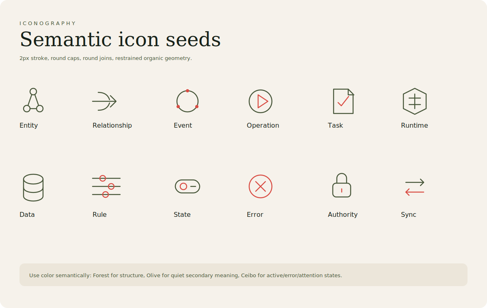

# Iconography

The Ontahí visual world uses a small set of recurring symbols:

- ceibo flower
- botanical outline
- paper
- code notebook
- relationship diagrams
- circular event loops
- layered task stacks

Symbols should be few and repeated carefully.

The system should feel coherent, not illustrated.

## Grammar

- Stroke: 2px
- Cap: round
- Join: round
- Corner radius: 4px
- Node radius: 5px
- Style: organic, clear, restrained

Icon families should map to Ontahí concepts: entities, relationships, events, operations, tasks, runtime, data, rules, authorization, state, errors, and synchronization.

## Current icons

- `assets/icons/entity.svg`
- `assets/icons/relationship.svg`
- `assets/icons/event.svg`
- `assets/icons/operation.svg`
- `assets/icons/task.svg`
- `assets/icons/runtime.svg`
- `assets/icons/data.svg`
- `assets/icons/rule.svg`
- `assets/icons/state.svg`
- `assets/icons/error.svg`
- `assets/icons/authority.svg`
- `assets/icons/synchronization.svg`

These icons are seeds. They establish grammar and semantic coverage before final optical refinement.
